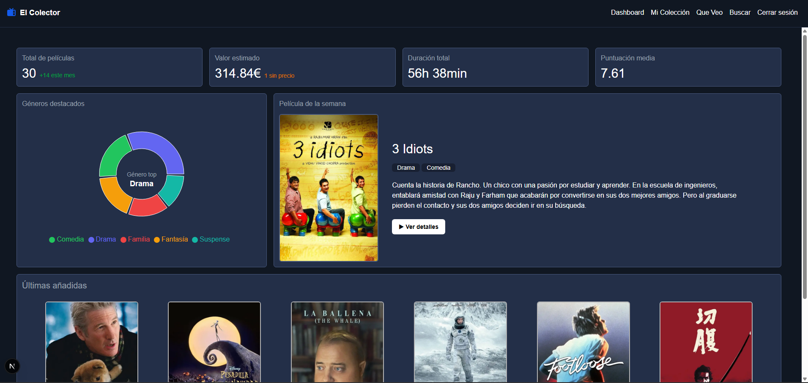
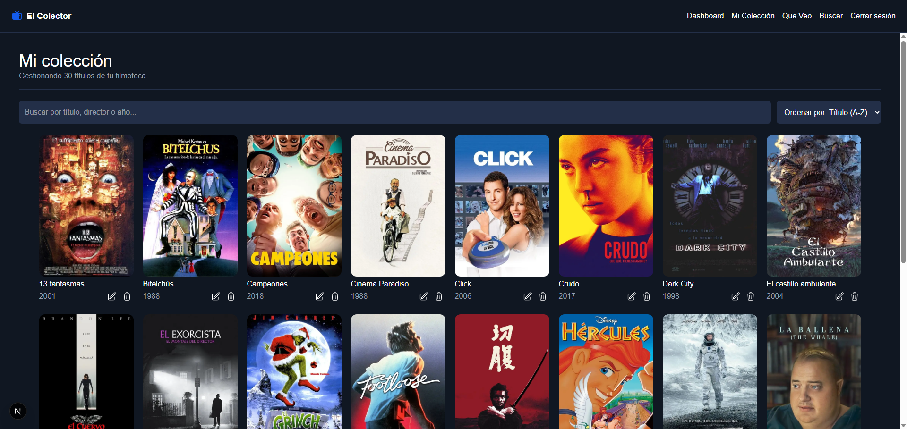
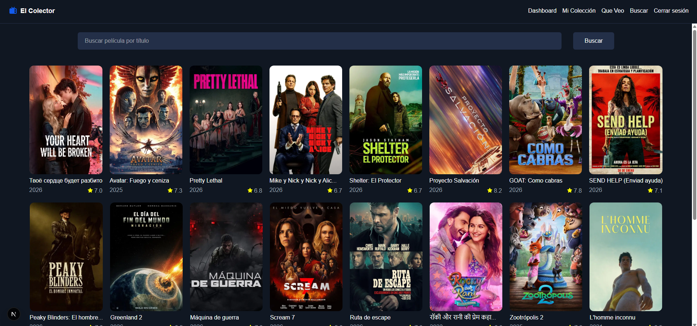
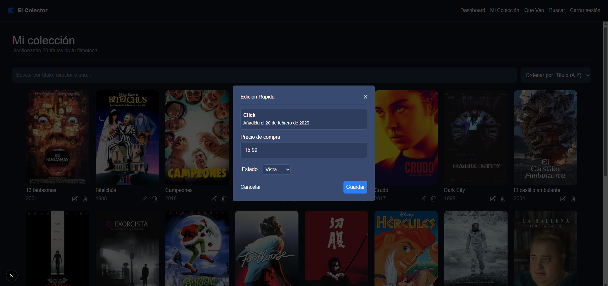

# 🎬 The Collector — Gestor Personal de Películas

Aplicación web full-stack diseñada para gestionar colecciones personales de películas, descubrir contenido y mejorar la experiencia de decisión del usuario mediante recomendaciones dinámicas.

---

## 🌐 Demo en vivo

👉 https://tu-app.vercel.app  
_(Desplegado en Vercel)_

---

## 🧭 Descripción

**The Collector** es una aplicación centrada en el usuario que permite crear, organizar y explorar una biblioteca personal de películas.

El proyecto nace con el objetivo de resolver un problema común:

> _Tengo una colección bastante extensa y no se si esa película la tengo ya en la colección_

Combina gestión de datos personalizada con mecanismos de recomendación simples pero efectivos.

---

## 🎞️ Imagenes

## ✨ Funcionalidades principales

### 🔐 Autenticación segura

- Registro e inicio de sesión con Firebase Authentication
- Aislamiento de datos por usuario

### 🎞️ Gestión de colección

- Añadir, visualizar y organizar películas
- Persistencia en tiempo real con Firestore

### 🎲 Recomendador aleatorio

- Selección dinámica de películas para descubrir nuevas películas.
- Mejora de engagement y toma de decisiones

### 🔍 Búsqueda de películas

- Exploración de películas
- Integración directa con la colección

### 📊 Dashboard

- Información detallada de la colección
- Acceso rápido a funcionalidades clave

---

## 🏗️ Arquitectura

La aplicación sigue una arquitectura basada en cliente + BaaS (Backend as a Service):

- **Frontend:** React / Next.js
- **Backend:** Firebase
- **Base de datos:** Firestore (NoSQL, en tiempo real)
- **Autenticación:** Firebase Authentication
- **Despliegue:** Vercel

### 🔍 Decisiones técnicas

- Uso de **Firestore** para simplificar backend y permitir escalabilidad sin infraestructura propia
- Modelo de datos orientado a usuario → cada colección es independiente
- Separación de responsabilidades por vistas (Dashboard, Buscador, Colección, Recomendador)
- Lógica de recomendación desacoplada, fácil de evolucionar a modelos más complejos

---
